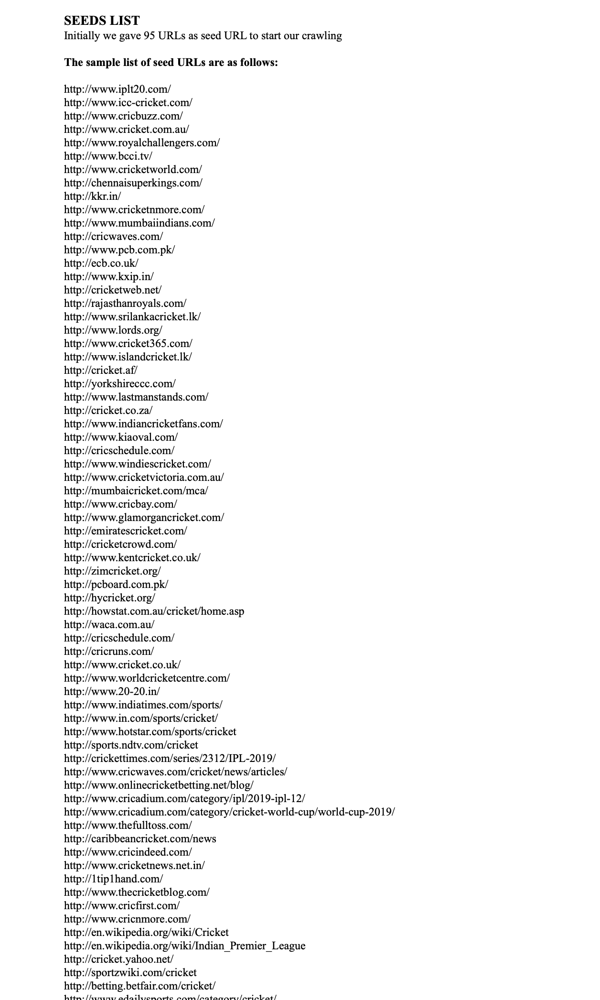
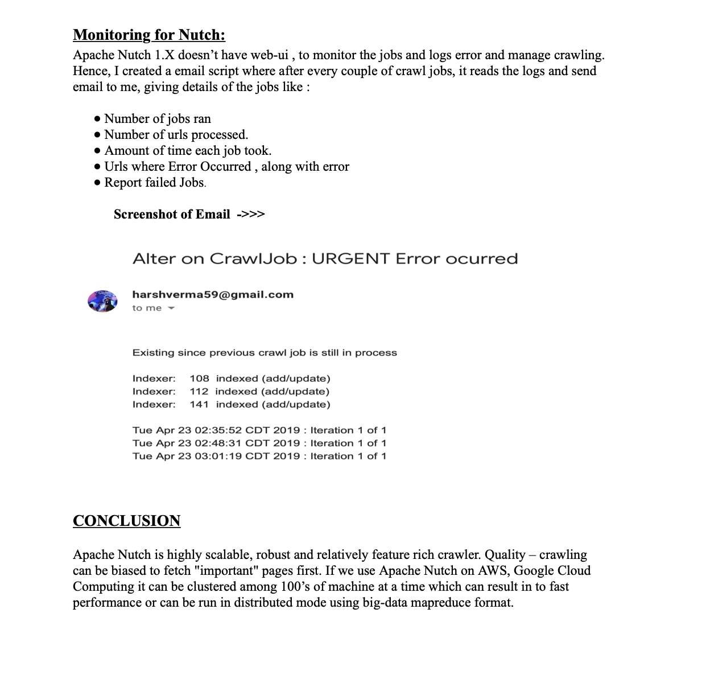

#CricketSearchEngine
**This repo contains the code of building cricket search engine from scratch and details of respective modules i.e crawling , clustering, indexing, query-expansion, webUI, Server**

**Cricket Search Engine**

**Report Details Starts here**

